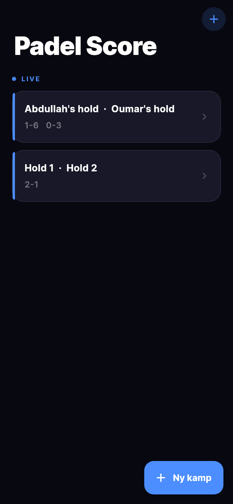
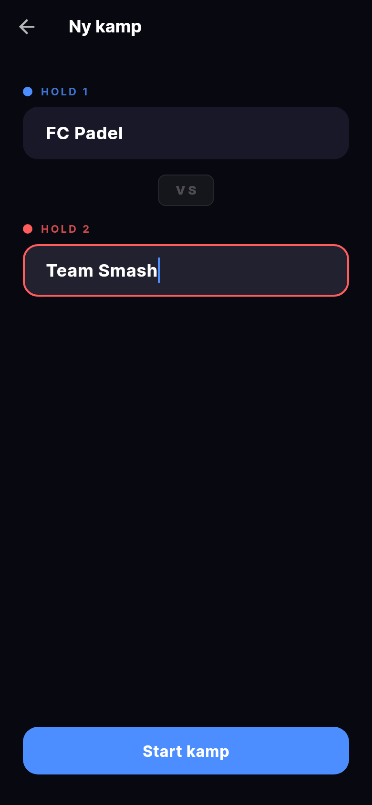
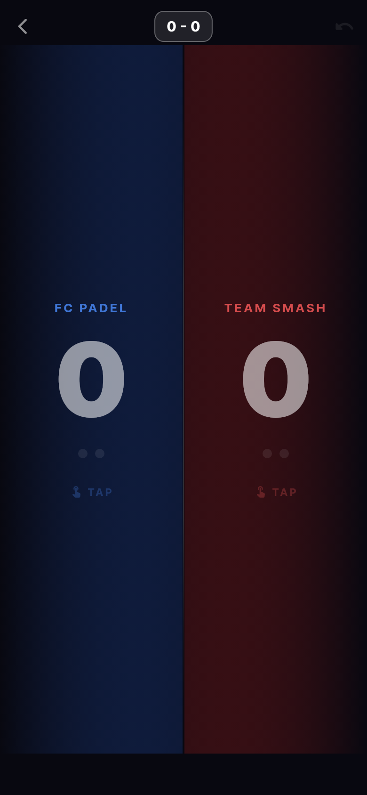
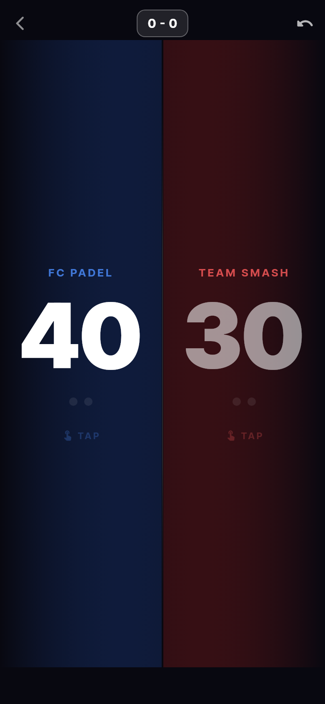
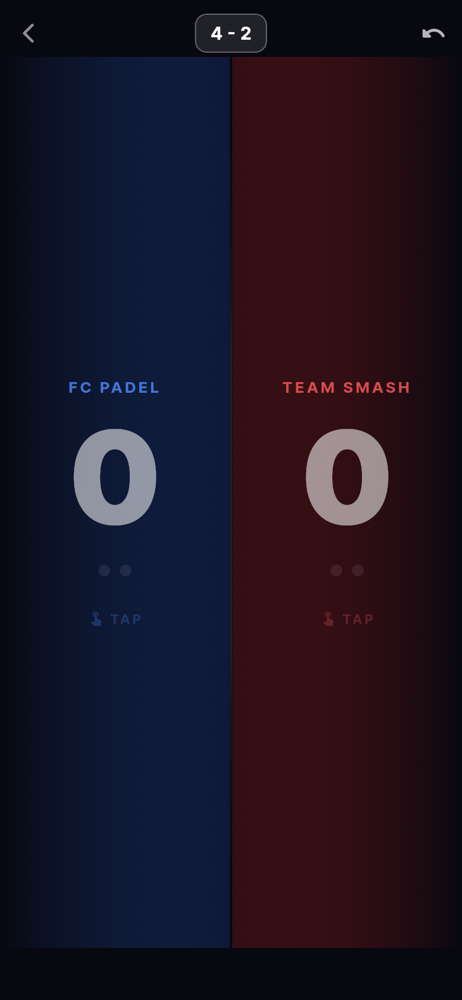
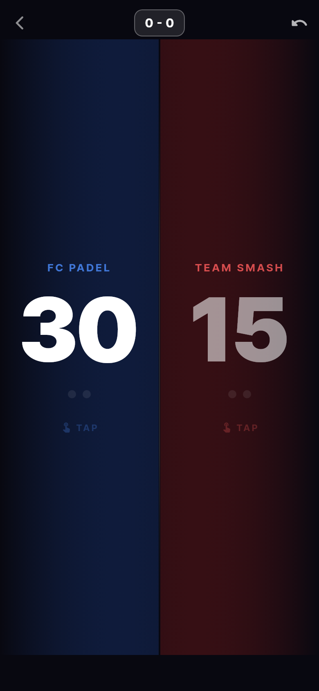

# Padel Score

Real-time padel score tracker til iOS, Android og web. Tryk på din sides halvdel af skærmen for at give dit hold et point — scoren opdateres live på alle enheder.

## Screenshots

<table>
  <tr>
    <td align="center"><b>Oversigt</b></td>
    <td align="center"><b>Ny kamp</b></td>
    <td align="center"><b>Score — 0-0</b></td>
  </tr>
  <tr>
    <td></td>
    <td></td>
    <td></td>
  </tr>
  <tr>
    <td align="center"><b>40 - 30</b></td>
    <td align="center"><b>Sætscore 4-2</b></td>
    <td align="center"><b>Under spil</b></td>
  </tr>
  <tr>
    <td></td>
    <td></td>
    <td></td>
  </tr>
</table>

## Features

- Fuld padel-scoring: 0 / 15 / 30 / 40 / Deuce / Advantage / Tiebreak
- Real-time sync via Firebase Firestore — alle enheder ser scoren live
- Undo op til 20 trin tilbage
- Tryk venstre/højre halvdel af skærmen for at give point
- Best of 3 sæt med tiebreak ved 6-6

## Tech stack

| Lag | Teknologi |
|---|---|
| App | Flutter (iOS, Android, Web) |
| State | Riverpod |
| Navigation | go_router |
| Database | Firebase Firestore |
| Fonts | Google Fonts (Inter) |

## Kom i gang

### 1. Klon og installer dependencies

```bash
git clone https://github.com/oumar969/padel-score.git
cd padel-score
flutter pub get
```

### 2. Opsæt Firebase

Følg vejledningen i [FIREBASE_SETUP.md](FIREBASE_SETUP.md).

### 3. Kør appen

```bash
flutter run
```

## IoT (kommer snart)

ESP32 med fysisk knap eller stemmestyring → giver point direkte til Firebase uden at røre telefonen.
