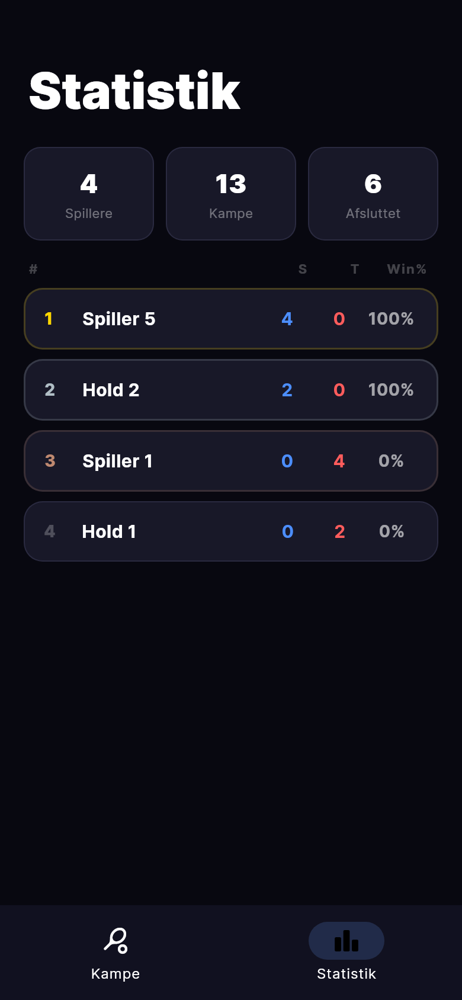

# Padel Score

Real-time padel score tracker til iOS, Android og web. Installér som PWA og tryk på din sides halvdel for at give point — scoren opdateres live på alle enheder.

## Screenshots

<table>
  <tr>
    <td align="center"><b>Kampe</b></td>
    <td align="center"><b>Statistik</b></td>
    <td align="center"><b>Score — Live</b></td>
  </tr>
  <tr>
    <td></td>
    <td></td>
    <td></td>
  </tr>
</table>

## Features

**Scoring**
- Fuld padel-scoring: 0 / 15 / 30 / 40 / Deuce / Advantage / Tiebreak
- Best of 3 sæt med tiebreak ved 6-6
- Undo op til 20 trin tilbage

**Live & Del**
- Real-time sync via Firebase Firestore
- Ejer-mode (scorer) vs. Tilskuer-mode (read-only med LIVE-badge)
- TV-skærm visning `/tv/:id` — kæmpe score til banen
- Del kamp-link med ét tryk

**Indstillinger per kamp**
- 🔥 Varm op timer — 5 min nedtælling
- 🎾 Serveindikator — skifter automatisk efter hvert spil
- ⏱ Timeout — 60 sek cirkulær nedtælling
- 🔔 Boldbytte påmindelse — efter 9 spil
- 💬 Live kommentarer — tilskuere skriver, spillere svarer

**Statistik**
- Leaderboard: sejre, tab, win%
- Bedste makker per spiller

**PWA**
- Installer på iPhone/Android hjemskærm — åbner som native app
- Offline-kapabel via service worker

## Tech stack

| Lag | Teknologi |
|---|---|
| App | Flutter (Web, iOS, Android) |
| State | Riverpod |
| Navigation | go_router |
| Database | Firebase Firestore (real-time) |
| Hosting | Firebase Hosting |
| Fonts | Google Fonts (Inter) |

## Kom i gang

### 1. Klon og installer dependencies

```bash
git clone https://github.com/oumar969/padel-score.git
cd padel-score
flutter pub get
```

### 2. Opsæt Firebase

Følg vejledningen i [FIREBASE_SETUP.md](FIREBASE_SETUP.md).

### 3. Kør appen

```bash
flutter run
```

## Deploy

```bash
flutter build web --release && firebase deploy --only hosting --project padel-score-ab0b5
```

Live: **https://padel-score-ab0b5.web.app**

## IoT (kommer snart)

ESP32 med fysisk knap eller stemmestyring → giver point direkte til Firebase uden at røre telefonen.
